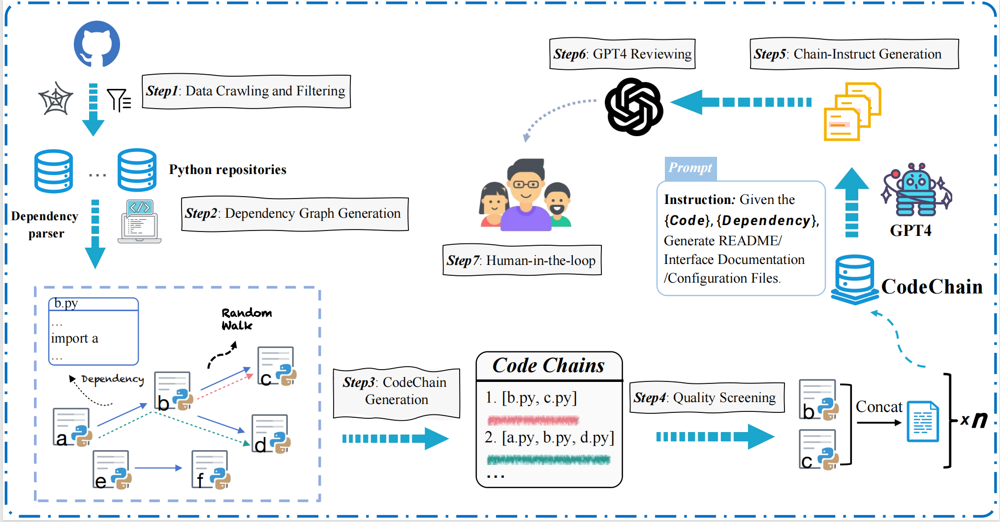

# Dataset Card for CodeChain

## Table of Contents
- [Dataset Description](#dataset-description)
  - [Dataset Summary](#dataset-summary)
  - [Supported Tasks](#supported-tasks-and-leaderboards)
  - [Code Languages](#languages)
- [Dataset Structure](#dataset-structure)
  - [Data Instances](#data-instances)
  - [Data Fields](#data-fields)
  - [Data Splits](#data-splits)
- [Dataset Creation](#dataset-creation)
  - [Creation Rationale](#curation-rationale)
  - [Source Data](#source-data)
- [Considerations for Using the Data](#considerations-for-using-the-data)
  - [Social Impact of Dataset](#social-impact-of-dataset)
  - [Discussion of Biases](#discussion-of-biases)
  - [Other Known Limitations](#other-known-limitations)
- [Additional Information](#additional-information)
  - [Dataset Curators](#dataset-curators)
  - [Licensing Information](#licensing-information)
  - [Citation Information](#citation-information)

## Dataset Description

- **Repository:** https://github.com/HC-Guo/Code-Chain
- **Point of Contact:** xxx (xx@xxx)

### Dataset Summary

We release CodeChain, an augmentation of the code pre-training dataset at the repository level, provides a rich context for code LLMs to learn from. We collecte over 50,000 Python repositories from GitHub, extract dependency relationships between files in each repository. Then, we employ a novel random walk method based on file dependencies to determine the code chain and concatenate the corresponding files. A text file is concatenated for each chain, with the Python code arranged in the sequence of their import calls according to the dependency chain. After quality screening, CodeChain contains 562587 chains from 31182 repositories. 

### Supported Tasks and Leaderboards

This is a dataset for code LLMs to learn at the repository level.

### Code Languages
Python

## Dataset Structure
You can directly download Codechain at urls like this:


### Dataset stats

|           Codechain                               |  | 
|-----------------------------------------------------|----------|
| Size                                       | 8.65GB    | 
| The Number of Chains| 562587 |
| The Number of Repos| 31182 |
| Average Chain Length| 1.79 |
| The Number of Chains (chain length > 1 )| 246776 |
| Average Chain Length (chain length > 1 )| 2.81 |


### Data Instances

Documents included in the file contain: codechains, a csv of index.
- `Codechains`: a series of txt files of concatenated python code of every chain.
- `index.csv`: the information mapping every chain to its code txt file for every repo. Each instance contains:
  * `filename`: a list contains the filenames of the concatenated code txt files.
  * `chains`: the specific dependency chains displayed in lists. 
            
Here's an example of the `index.csv`:
```
filename :[
‘../dataset/Codechains/CrossLoc_0_concatenated_files.txt',
’../dataset/Codechains/CrossLoc_1_concatenated_files.txt', '../dataset/Codechains/CrossLoc_2_concatenated_files.txt',
'../dataset/Codechains/CrossLoc_3_concatenated_files.txt', '../dataset/Codechains/CrossLoc_4_concatenated_files.txt',
'../dataset/Codechains/CrossLoc_5_concatenated_files.txt', ‘../dataset/Codechains/CrossLoc_6_concatenated_files.txt']

chains :[
	['CrossLoc/utils/learning.py', 'CrossLoc/loss/depth.py', ‘CrossLoc/finetune_decoder_single_task.py'],
  ['CrossLoc/dsacstar/setup.py'], 
	['CrossLoc/dataloader/__init__.py'], 
  ['CrossLoc/loss/semantics.py', 'CrossLoc/train_single_task.py'], 
	['CrossLoc/utils/learning.py', 'CrossLoc/train_single_task.py'], 
	['CrossLoc/dsacstar/setup_super.py'], 
	['CrossLoc/networks/networks.py', 'CrossLoc/utils/learning.py', ‘CrossLoc/test_single_task.py']
]

```
Each list in `chains` corresponds to a txt file. For a list [a.py, b.py, c.py]. The dependency relationship is : ‘a.py’ imported in ‘b.py’, ‘b.py’ imported in ‘c.py’. 

Here's an example text file of the `Codechains`, '....' means the original python code:

```
The code dependency chain is : ['Addarr/src/transmission.py', 'Addarr/src/addarr.py', 'Addarr/src/delete.py']
""" 
Addarr/src/transmission.py
"""

.......

""" 
Addarr/src/addarr.py
"""

.......

"""
'Addarr/src/delete.py'
"""

.......

```


### Data Fields

See above.

### Data Splits

N/A, this is a pretraining dataset.

## Dataset Creation

The dataset was created from the middle of 2024 to early 2023 at the Allen Institute for AI.

### Creation Rationale
Code large language models (LLMs) have shown remarkable advances in code understanding and generation tasks. Programming corpora, composed of a collection of public code projects and documentation, serve as the foundation for various code LLMs. In real-world software development scenario, repositories often consist of multiple files with numerous cross-file dependencies. Leveraging the dependency information can effectively enhance the code understanding and generation capabilities. However, most of existing datasets randomly concatenate files, fail to utilize dependencies effectively. Consequently, there is a pressing need for an open dataset that specifically focus on capturing and leveraging the dependencies between files.


To fill in this gap, we release \ourdata{}, an augmentation of the code pre-training dataset at the repository level, provides a rich context for code LLMs to learn from. 

### Data Creation Process

In-context learning \cite{brown2020language} enables sequence models to adapt to new tasks without any parameter updates by interleaving a few supervised examples in a prompt. 

### Source Data

#### Initial Data Collection and Filtering

See the paper for more details.

#### Who are the source producers?

Authors of publicly accessible repositories on Github.


## Considerations for Using the Data

### Social Impact of Dataset

Potential benefits:

- CodeChain provides a richer context for LLMs to learn from by augmenting the code pre-training dataset at the repository level. This richer context can lead to improved model performance and understanding of code semantics.
- We develop a comprehensive data curation pipeline that begins with scraping publicly available GitHub repositories and our method ensures the generation of dependencies in the true file order, which is crucial for handling code repositories. This could help others to build upon our works and furthur advance the ability of Code LLMs at the repository level.

Potential risks:

- Collecting code from over 50,000 Python repositories from GitHub raises potential privacy and legal concerns, especially if the code includes proprietary or copyrighted material without proper authorization or consent.
- Like any large-scale dataset sourced from online repositories, CodeChain may inadvertently capture and perpetuate biases present in the original data sources. This could lead to biased model predictions and reinforce existing societal inequalities in code development and usage.

### Discussion of Biases

- The dataset is derived from GitHub repositories, which may not represent the full spectrum of coding practices and styles across different programming communities. Certain programming paradigms or niche domains may be overrepresented or underrepresented.
- The method of extracting dependency relationships and determining code chains through random walks may inadvertently prioritize certain code structures or project architectures over others. Biases in the dependency resolution algorithm could influence the composition of the code chains and the learning opportunities provided to code LLMs.

### Other Known Limitations

- CodeChain focuses on Python repositories, potentially excluding insights from other programming languages. 
- The criteria used for quality screening may inadvertently favor certain types of code or repositories, potentially excluding valuable but unconventional coding practices from the dataset.

## Additional Information

### Dataset Curators



See the paper for more details.

### Licensing Information

[](https://lbesson.mit-license.org/)

This code is licensed under a MIT License.

[](http://creativecommons.org/licenses/by-nc-sa/4.0/)

The dataset is licensed under a
[Creative Commons Attribution-NonCommercial-ShareAlike 4.0 International License](http://creativecommons.org/licenses/by-nc-sa/4.0/).

